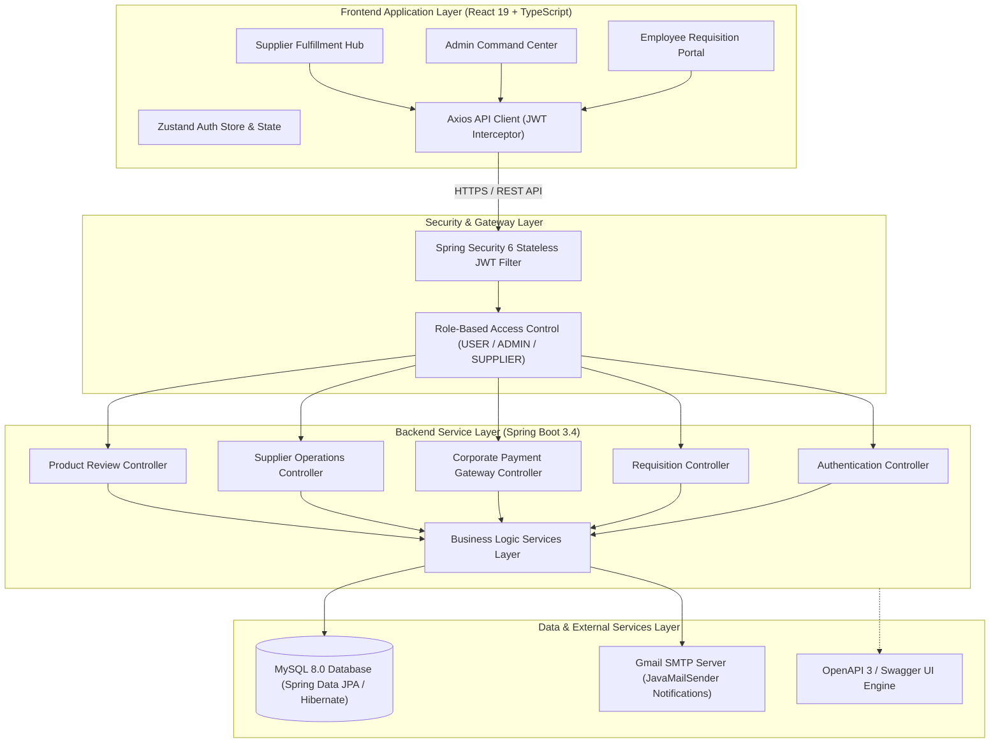
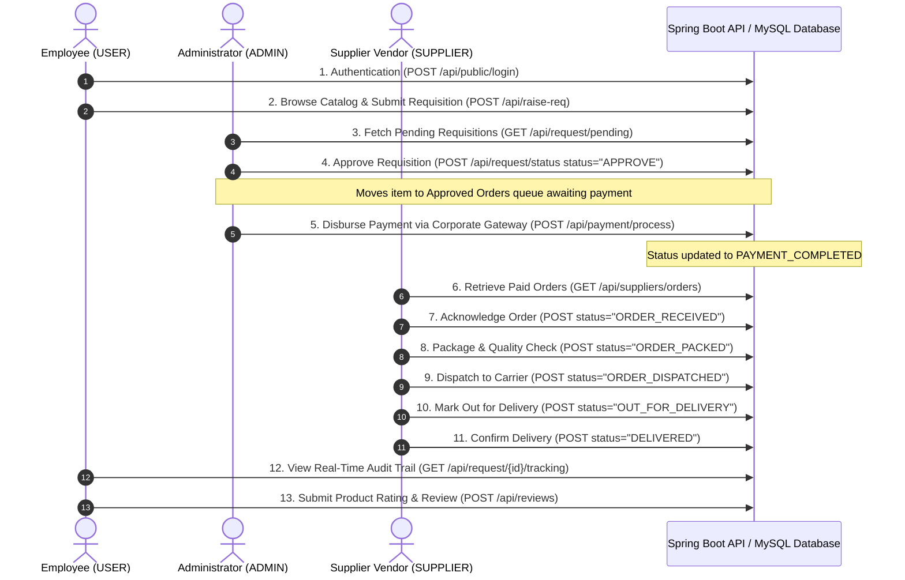

# Enterprise Procurement Platform (ProcurFlow)

A full-stack, enterprise-grade Procurement and Supply Chain Lifecycle Management Platform built with Spring Boot 3.4 REST APIs, React 19 Single Page Application, role-based security, automated bank remittance simulations, sequential logistics fulfillment, audit logging, and product quality reviews.

---

## Executive Summary

ProcurFlow streamlines organizational procurement workflows across three distinct roles: Employees (Requisitioners), System Administrators (Approvers & Payers), and Supplier Vendors (Fulfillers). The platform enforces strict sequential state transitions, automated audit trailing, corporate credit card disbursements, and supplier inventory management.

---

## System Architecture & Sequence Flow

### High-Level System Architecture



### End-to-End Persona Sequence Flow



---

## Technical Stack

### Frontend Application
- **Framework**: React 19, TypeScript, Vite 8
- **Routing**: React Router v7
- **State Management**: Zustand 5 with persistent state storage
- **Styling & Design System**: Tailwind CSS v4, Geist Variable Font, Vanilla CSS Tokens
- **UI Components**: Base UI (`@base-ui/react`), Shadcn UI patterns, Lucide React icons
- **Animations & Micro-interactions**: Motion 13
- **Notifications**: Sonner toast notification engine

### Backend Service
- **Framework**: Java 21, Spring Boot 3.4
- **Security**: Spring Security 6 with stateless JWT authorization (`io.jsonwebtoken` 0.12.6)
- **Database & Persistence**: MySQL 8, Spring Data JPA, Hibernate ORM
- **Messaging & Email**: Spring Boot Starter Mail (`JavaMailSender`) with Gmail SMTP integration
- **API Documentation**: OpenAPI 3 / Swagger UI (`springdoc-openapi` 2.8.5)

---

## Directory Structure

```
infosys-project/
├── backend/
│   ├── src/
│   │   ├── main/
│   │   │   ├── java/in/sujeeth/
│   │   │   │   ├── config/         # Security & JWT configurations
│   │   │   │   ├── controller/     # REST Controllers for auth, req, payment, supplier
│   │   │   │   ├── dto/            # Data Transfer Objects
│   │   │   │   ├── model/          # JPA Domain Entities
│   │   │   │   ├── repository/     # Spring Data Repositories
│   │   │   │   └── service/        # Business Logic Services
│   │   │   └── resources/
│   │   │       ├── application.yml # Database & SMTP settings
│   │   │       └── data.sql        # Initial seed scripts
│   └── pom.xml                     # Maven dependencies
├── frontend/
│   ├── src/
│   │   ├── api/                    # Axios API client modules
│   │   ├── components/             # UI Components & Layouts
│   │   ├── pages/                  # Page Views (User, Admin, Supplier dashboards)
│   │   ├── routes/                 # Protected & Public Route definitions
│   │   ├── stores/                 # Zustand authentication & state stores
│   │   ├── App.tsx                 # Application entry root
│   │   └── index.css               # Global theme tokens & Tailwind imports
│   ├── package.json
│   └── vite.config.ts
└── README.md
```

---

## Core Operational Personas

### 1. Employee (`USER` Role)
- **Equipment Catalog**: Browse hardware categories (Electronics, Peripherals, Furniture, Office Supplies) with aggregated product ratings.
- **Requisition Station**: Create procurement requisitions specifying quantity, department, and business justification.
- **Personal Ledger & Receipts**: Track personal order history and export transaction receipts to CSV format.
- **Audit Timeline**: View detailed step-by-step progress from administrative approval through final delivery.
- **Feedback & Reviews**: Submit 1 to 5 star ratings and written reviews for delivered hardware items.

### 2. System Administrator (`ADMIN` Role)
- **Command Center KPIs**: Monitor real-time metrics for pending approvals, unpaid orders, disbursed funds, and active supplier networks.
- **Approval Queue**: Review pending requisitions with single-click approval or rejection workflows.
- **Payment Disbursement Gateway**: Process corporate payments to suppliers with integrated payment authorization validation and automatic card details autofill.
- **Master Ledger & Controls**: Access comprehensive request lists, export financial transaction histories to CSV, and manage organization users/suppliers.

### 3. Supplier Vendor (`SUPPLIER` Role)
- **Paid Order Queue**: Access orders upon successful administrative disbursement.
- **Sequential Fulfillment Lifecycle**: Update delivery stages sequentially without skipped steps (`ORDER_RECEIVED` -> `ORDER_PACKED` -> `ORDER_DISPATCHED` -> `OUT_FOR_DELIVERY` -> `DELIVERED`).
- **State Protection**: Built-in backend safeguards prevent duplicate status updates or modifications to completed orders.
- **Inventory Management**: Track stock levels and restock items directly in the supplier portal.

---

## Complete REST API Specification

| Category | Endpoint | Method | Role Authorization | Description |
|---|---|---|---|---|
| **Authentication** | `/api/public/register` | `POST` | Public | Employee account registration |
| **Authentication** | `/api/public/login` | `POST` | Public | Employee and Supplier authentication |
| **Authentication** | `/api/public/admin/login` | `POST` | Public | System Administrator authentication |
| **Organization** | `/api/departments` | `GET` | Authenticated | List available departments |
| **Catalog** | `/api/categories` | `GET` | Authenticated | List hardware product categories |
| **Catalog** | `/api/products` | `GET` | Authenticated | List active product catalog |
| **Requisition** | `/api/raise-req` | `POST` | `USER` / `ADMIN` | Submit procurement requisition |
| **Requisition** | `/api/request/pending` | `GET` | Authenticated | Fetch pending approvals queue |
| **Requisition** | `/api/request/approved` | `GET` | `ADMIN` | Fetch approved orders awaiting payment |
| **Requisition** | `/api/request/all` | `GET` | `ADMIN` | Fetch complete requisition history |
| **Requisition** | `/api/request/status` | `GET` | Authenticated | Retrieve requisition details by ID |
| **Requisition** | `/api/request/status` | `POST` | `ADMIN` | Approve or reject requisition |
| **Requisition** | `/api/request/{id}` | `DELETE` | `ADMIN` | Soft-delete requisition / deactivate product |
| **Audit Log** | `/api/request/{id}/tracking` | `GET` | Authenticated | Fetch delivery audit trail |
| **Payments** | `/api/payment/process` | `POST` | `ADMIN` | Disburse supplier payment via corporate gateway |
| **Payments** | `/api/payment/history` | `GET` | `ADMIN` | Exportable global payment ledger |
| **Payments** | `/api/payment/user` | `GET` | `USER` | Exportable user transaction ledger |
| **Suppliers** | `/api/suppliers` | `GET` | Authenticated | List verified suppliers |
| **Suppliers** | `/api/suppliers/orders` | `GET` | `SUPPLIER` / `ADMIN` | Fetch paid orders assigned to supplier |
| **Suppliers** | `/api/suppliers/products/{id}/restock` | `POST` | `SUPPLIER` | Restock catalog inventory |
| **Suppliers** | `/api/suppliers/orders/{id}/status` | `POST` | `SUPPLIER` | Update fulfillment status milestone |
| **User Directory** | `/api/users` | `GET` | `ADMIN` | Master directory of registered employees |
| **Reviews** | `/api/reviews` | `POST` | `USER` / `ADMIN` | Submit product star rating and review |
| **Reviews** | `/api/reviews/product/{id}/summary` | `GET` | Authenticated | Retrieve product average rating summary |

---

## Seed Credentials & Initial Database Loading

All initial account credentials are automatically populated from `backend/.env` during the first database load (when no admin user exists in the database).

| Account Role | Environment Variable Keys | Source |
|---|---|---|
| **System Administrator** | `SEED_ADMIN_EMAIL`, `SEED_ADMIN_PASSWORD` | Configured in `backend/.env` |
| **Sample Employee** | `SEED_USER_EMAIL`, `SEED_USER_PASSWORD` | Configured in `backend/.env` |
| **Supplier: TechSource** | `SEED_SUPPLIER_TECHSOURCE_EMAIL`, `SEED_SUPPLIER_PASSWORD` | Configured in `backend/.env` |
| **Supplier: ErgoComfort** | `SEED_SUPPLIER_ERGOCOMFORT_EMAIL`, `SEED_SUPPLIER_PASSWORD` | Configured in `backend/.env` |
| **Supplier: OfficeDepot** | `SEED_SUPPLIER_OFFICEDEPOT_EMAIL`, `SEED_SUPPLIER_PASSWORD` | Configured in `backend/.env` |
| **Supplier: CloudTech** | `SEED_SUPPLIER_CLOUDTECH_EMAIL`, `SEED_SUPPLIER_PASSWORD` | Configured in `backend/.env` |

> [!NOTE]
> `DataInitializer` checks if an admin user already exists. If an admin is present in the database, initial seed data generation is skipped.

### Demo Corporate Payment Card
```json
{
  "cardNumber": "4111222233334444",
  "cardHolderName": "Single System Administrator",
  "expiryDate": "12/28",
  "cvv": "123",
  "remarks": "Payment transferred to Supplier bank account"
}
```

---

## Setup & Running Instructions

### Prerequisites
- Java Development Kit (JDK) 21 or higher
- Node.js v20.0.0 or higher
- MySQL Server 8.0 or higher
- Maven 3.9+ (or use included `./mvnw`)

### 1. Environment Configuration (.env)
Create a `.env` file in the `backend/` directory (you can copy from `.env.example`):

```bash
cd backend
cp .env.example .env
```

Edit `backend/.env` with your actual database, SMTP mail, and JWT secret credentials:

```env
# Database Configuration
DB_HOST=localhost
DB_PORT=3306
DB_NAME=procurement_db
DB_USERNAME=root
DB_PASSWORD=your_db_password

# Mail Configuration
MAIL_HOST=smtp.gmail.com
MAIL_PORT=587
MAIL_USERNAME=your_email@gmail.com
MAIL_PASSWORD=your_app_password

# Security Configuration
JWT_SECRET=your_jwt_base64_secret_key

# Server Configuration
SERVER_PORT=8080

# Initial Seed Data Configuration
SEED_ADMIN_EMAIL=admin@example.com
SEED_ADMIN_PASSWORD=AdminPassword123

SEED_USER_EMAIL=user@example.com
SEED_USER_PASSWORD=UserPassword123

SEED_SUPPLIER_PASSWORD=SupplierPassword123
SEED_SUPPLIER_TECHSOURCE_EMAIL=supplier1@example.com
SEED_SUPPLIER_ERGOCOMFORT_EMAIL=supplier2@example.com
SEED_SUPPLIER_OFFICEDEPOT_EMAIL=supplier3@example.com
SEED_SUPPLIER_CLOUDTECH_EMAIL=supplier4@example.com
```

### 2. Start Backend Application
Export the `.env` variables to your terminal session and execute the Spring Boot application:

```bash
cd backend
export $(grep -v '^#' .env | xargs)
./mvnw spring-boot:run
```

- **Backend Base API**: `http://localhost:8080`
- **OpenAPI / Swagger UI Documentation**: `http://localhost:8080/swagger-ui.html`

### 3. Start Frontend Application
Navigate to the `frontend` directory, install dependencies, and start the development server:

```bash
cd frontend
npm install
npm run dev
```

- **Frontend Web Application**: `http://localhost:5173`

---

## Verification & Code Quality Commands

### Frontend Typecheck & Build Verification
```bash
cd frontend
npm run typecheck
npm run build
```

### Backend Build & Test Execution
```bash
cd backend
./mvnw clean test
```
