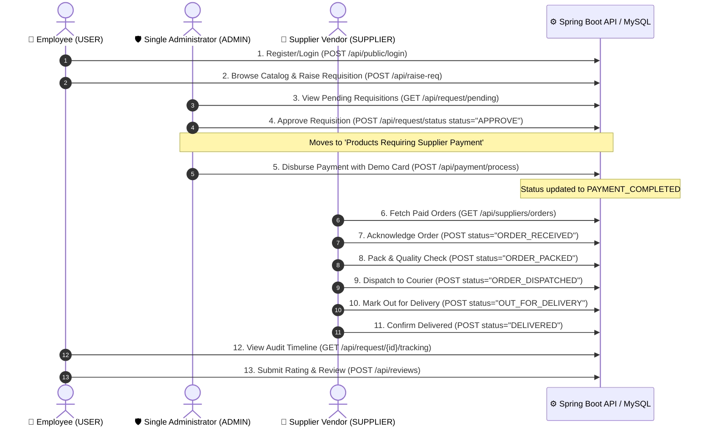

# Enterprise Procurement System (ProcurFlow)

A full-stack, enterprise-grade **Procurement & Supply Chain Lifecycle Management Platform** featuring Spring Boot 3.4 REST APIs, React 19 SPA, role-based workflows, automated bank payments, sequential logistics fulfillment, audit trails, and product quality reviews.

---

## 1. Architectural Overview & Persona Flow



---

## 2. Tech Stack

### Frontend
- **Framework**: React 19, TypeScript, Vite
- **Routing**: `react-router` (v7)
- **State Management**: Zustand (with persistent auth store)
- **Styling**: Tailwind CSS v4, Vanilla CSS tokens, Geist font typography
- **Components**: Shadcn / Base UI (`@base-ui/react`), Lucide React icons
- **Animations**: `motion` micro-interactions
- **Feedback & Toasts**: Sonner

### Backend
- **Framework**: Java 21, Spring Boot 3.4
- **Security**: Spring Security 6, Stateless JWT Authentication (`io.jsonwebtoken` 0.12.6)
- **Database & ORM**: MySQL 8, Spring Data JPA, Hibernate
- **Email Service**: Spring Boot Mail (`JavaMailSender`), Gmail SMTP
- **API Documentation**: OpenAPI 3 / Swagger UI (`springdoc-openapi`)

---

## 3. Core Role Capabilities

### 👤 1. Employee (`USER` Role)
- **Hardware Catalog**: Filter catalog items by categories (`Electronics`, `Peripherals`, `Furniture`, `Office Supplies`) with live star ratings (`GET /api/products`, `GET /api/categories`).
- **Requisition Station**: Raise equipment requests with quantity and business justification (`POST /api/raise-req`).
- **Requisitions Ledger**: Track orders and export payment receipts to CSV (`GET /api/payment/user?exportCsv=true`).
- **Live Audit Trail**: Inspect detailed vertical timeline of approvals, payment disbursement, and courier milestones (`GET /api/request/{id}/tracking`).
- **Product Reviews**: Submit star ratings (1–5) and performance feedback on delivered items (`POST /api/reviews`).

### 🛡️ 2. Single Administrator (`ADMIN` Role)
- **Command Center KPIs**: Real-time counters for pending approvals, orders awaiting payment, total remitted amount, and registered network.
- **Section 1: Requisitions Awaiting Approval**: 1-click **Approve** and **Reject** decisions (`POST /api/request/status`).
- **Section 2: Products Requiring Supplier Payment**: Live panel showing all approved items (`GET /api/request/approved`) with exact product, quantity, department, and total amount.
- **Preloaded Payment Gateway**: Disburse bank remittances (`POST /api/payment/process`) with a 1-click **Autofill Demo Card Details** button.
- **Master Requests Station**: Search, filter, and soft-delete/deactivate requests (`DELETE /api/request/{id}`).
- **Supplier Payment Ledger**: Complete transaction history with CSV export (`GET /api/payment/history?exportCsv=true`).
- **Organization Directory**: Master directory of employees (`GET /api/users`) and verified suppliers (`GET /api/suppliers`).

### 🚚 3. Supplier / Vendor Partner (`SUPPLIER` Role)
- **Order Visibility Rule**: Only sees orders after the Admin has disbursed payment (`GET /api/suppliers/orders`).
- **Sequential Stage Progression**: Advances fulfillment one milestone at a time without duplicates:
  `ORDER_RECEIVED` ➔ `ORDER_PACKED` ➔ `ORDER_DISPATCHED` ➔ `OUT_FOR_DELIVERY` ➔ `DELIVERED`.
- **Duplicate Protection**: Backend blocks repeated updates or changes to already delivered orders.
- **Catalog Stock & Restock**: View supplied SKUs and dispatch inventory replenishment (`POST /api/suppliers/products/{id}/restock`).

---

## 4. Complete REST API Matrix (20 Endpoints)

| Category | Endpoint | Method | Role | Description |
|---|---|---|---|---|
| **Auth** | `/api/public/register` | `POST` | Public | Register new employee |
| **Auth** | `/api/public/login` | `POST` | Public | Employee & Supplier login |
| **Auth** | `/api/public/admin/login` | `POST` | Public | Single Admin login |
| **Org** | `/api/departments` | `GET` | Authenticated | List departments |
| **Catalog** | `/api/categories` | `GET` | Authenticated | List product categories |
| **Catalog** | `/api/products` | `GET` | Authenticated | List catalog equipment |
| **Requisition** | `/api/raise-req` | `POST` | `USER` / `ADMIN` | Submit procurement request |
| **Requisition** | `/api/request/pending` | `GET` | Authenticated | List pending approval queue |
| **Requisition** | `/api/request/approved`| `GET` | `ADMIN` | List approved orders awaiting payment |
| **Requisition** | `/api/request/all` | `GET` | `ADMIN` | List all system requisitions |
| **Requisition** | `/api/request/status` | `GET` | Authenticated | Get request details by ID |
| **Requisition** | `/api/request/status` | `POST` | `ADMIN` | Approve or Reject requisition |
| **Requisition** | `/api/request/{id}` | `DELETE` | `ADMIN` | Delete request / deactivate product |
| **Audit** | `/api/request/{id}/tracking` | `GET` | Authenticated | Vertical delivery audit trail |
| **Payments** | `/api/payment/process` | `POST` | `ADMIN` | Disburse supplier payment |
| **Payments** | `/api/payment/history` | `GET` | `ADMIN` | All payments ledger (`?exportCsv=true`) |
| **Payments** | `/api/payment/user` | `GET` | `USER` | User payments ledger (`?exportCsv=true`) |
| **Suppliers** | `/api/suppliers` | `GET` | Authenticated | List verified suppliers |
| **Suppliers** | `/api/suppliers/orders`| `GET` | `SUPPLIER` / `ADMIN` | List paid orders assigned to supplier |
| **Suppliers** | `/api/suppliers/products/{id}/restock` | `POST` | `SUPPLIER` | Restock catalog inventory |
| **Suppliers** | `/api/suppliers/orders/{id}/status` | `POST` | `SUPPLIER` | Update delivery stage |
| **Users** | `/api/users` | `GET` | `ADMIN` | Master employees directory |
| **Reviews** | `/api/reviews` | `POST` | `USER` / `ADMIN` | Submit product star rating & review |
| **Reviews** | `/api/reviews/product/{id}/summary` | `GET` | Authenticated | Product average rating & count |

---

## 5. Seed Credentials & Demo Data

### 🛡️ Single System Administrator
- **Email**: `infosys.procurement.project.admin@gmail.com`
- **Password**: `Admin@123`

### 👤 Demo Employee
- **Email**: `sjvarma27@gmail.com` (or register a new user on `/register`)
- **Password**: `User@123`

### 🚚 Verified Supplier Accounts
- **TechSource Electronics**: `sujeethvarma27@gmail.com` / `Supplier@123`
- **ErgoComfort Furniture**: `contact@ergocomfort.in` / `Supplier@123`
- **OfficeDepot Stationeries**: `support@officedepot.in` / `Supplier@123`

### 💳 Demo Corporate Credit Card
```json
{
  "cardNumber": "4111222233334444",
  "cardHolderName": "Single System Administrator",
  "expiryDate": "12/28",
  "cvv": "123",
  "remarks": "Payment transferred to Supplier bank account"
}
```

---

## 6. Quick Start & Execution

### 1. Database Setup
Ensure MySQL is running on `localhost:3306`:
```yaml
# backend/src/main/resources/application.yml
url: jdbc:mysql://localhost:3306/procurement_db?createDatabaseIfNotExist=true
username: root
password: Root@1234
```

### 2. Run Backend (Spring Boot)
```bash
cd backend
./mvnw spring-boot:run
```
- **Backend API**: `http://localhost:8080`
- **Swagger UI**: `http://localhost:8080/swagger-ui.html`

### 3. Run Frontend (React + Vite)
```bash
cd frontend
npm install
npm run dev
```
- **Web App**: `http://localhost:5173`
