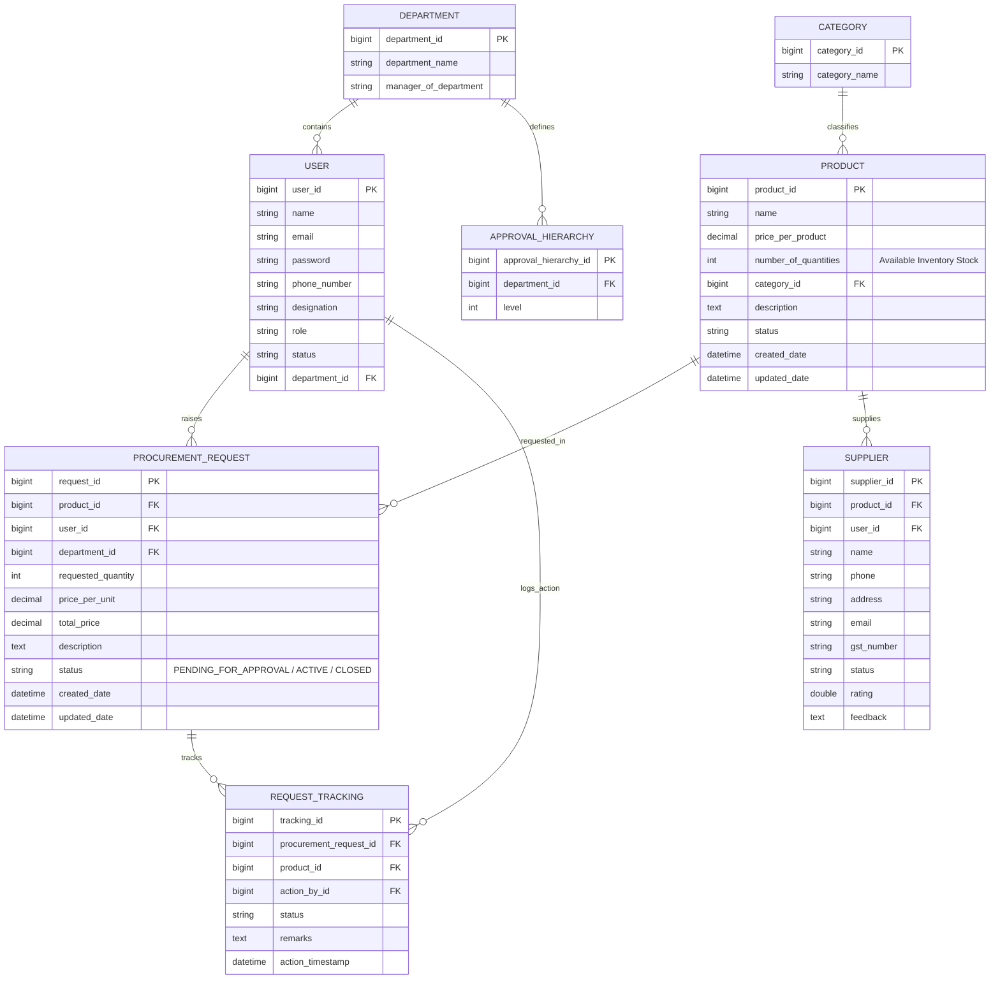
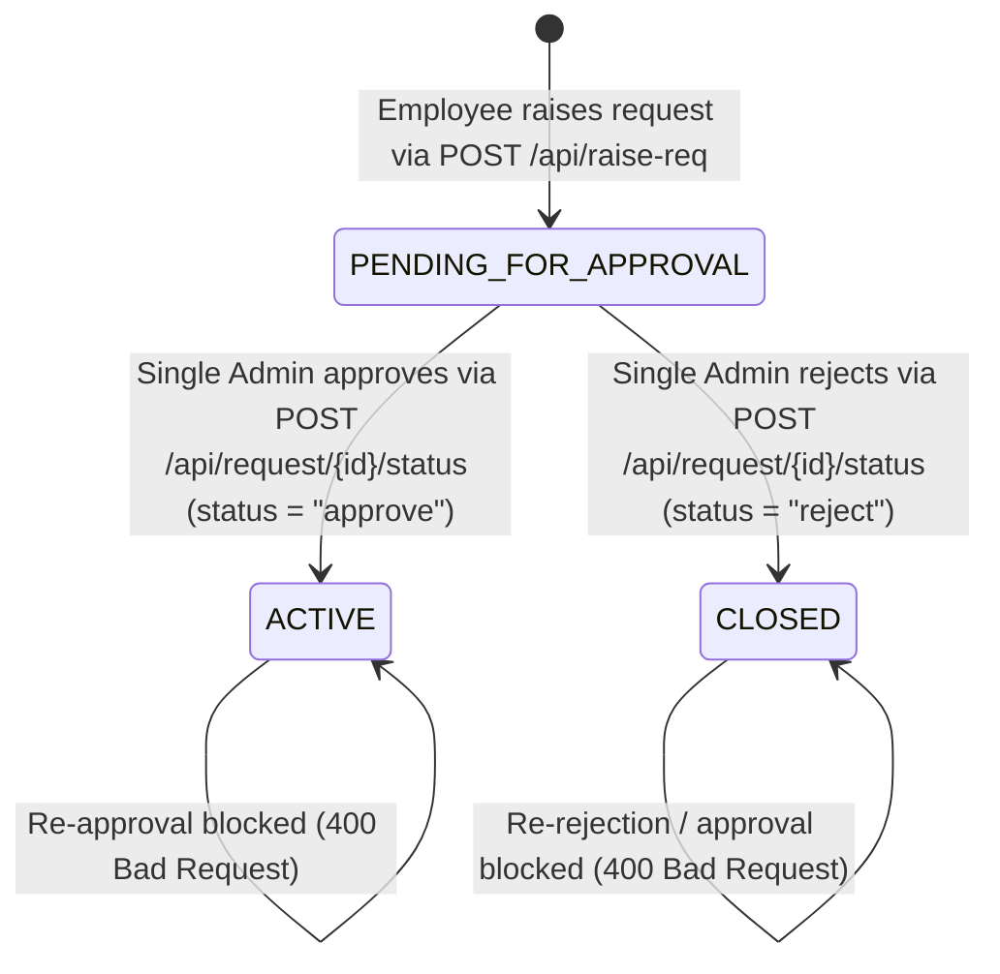

# Enterprise Procurement System — Application Walkthrough

The **Enterprise Procurement System** is a robust Spring Boot REST API backend supporting employee registration, procurement request raising, single-admin approval workflows, supplier management, and audit tracking.

---

## 1. System Architecture & Tech Stack

- **Language & Framework**: Java 21, Spring Boot 4.1
- **Security**: Spring Security 6 with Stateless JWT Authentication (`io.jsonwebtoken` 0.12.6)
- **Database**: MySQL 8.0, Spring Data JPA, Hibernate ORM
- **Validations**: Jakarta Bean Validation (`@NotBlank`, `@NotNull`, `@Email`, `@Min`, `@DecimalMin`)
- **Documentation**: Swagger UI / OpenAPI 3 (`springdoc-openapi-starter-webmvc-ui`)
- **API Testing**: Pre-built Postman Collection ([`Enterprise_Procurement_System.postman_collection.json`](file:///home/sujeeth/projects/Infosys-Intern-Project/Enterprise_Procurement_System.postman_collection.json))

---

## 2. Database Schema Design (8 Tables)



---

## 3. Core Business Workflow & Approval Lifecycle



1. **Request Raising**: Employees (`USER` role) raise procurement requests containing product details, price per unit, quantity, category, and description. Initial status is set to `PENDING_FOR_APPROVAL`.
2. **Single Admin Approvals & Stock Deduction**:
   - All procurement requests across all departments are reviewed by the Single Admin (`admin@company.com`).
   - **Inventory Check**: Upon approval (`POST /api/request/{id}/status` with `{"status": "approve"}`), the system checks existing active catalog inventory for the product:
     - **If Stock is Sufficient**: Deducts the requested quantity from available stock, transitions status to `ACTIVE`, and logs audit trail.
     - **If Stock is Insufficient**: Blocks approval with `400 Bad Request` (*"Insufficient inventory stock for product... Please request supplier restocking before approval"*).
3. **Strict State Transitions (Idempotent)**:
   - Approving sets status to `ACTIVE` (catalogs/fulfills the product request).
   - Approving an already `ACTIVE` request returns `400 Bad Request` (*"Product request is already approved and cannot be approved again"*).
   - Approving a `CLOSED` request returns `400 Bad Request` (*"Cannot approve a closed/rejected product request"*).
   - Rejecting sets status to `CLOSED`.
   - Rejecting an already `CLOSED` request returns `400 Bad Request` (*"Product request is already closed/rejected and cannot be rejected again"*).
   - Rejecting an `ACTIVE` request returns `400 Bad Request` (*"Cannot reject an already approved product request"*).
4. **Audit Trail Logging**: Every status transition generates an immutable `RequestTracking` audit record.

---

## 4. API Reference Summary

### Public & Authentication Routes (`/api/public/*`)
| Method | Endpoint | Description |
| ------ | -------- | ----------- |
| `POST` | `/api/public/register` | Register employee with details & department (`USER` role) |
| `POST` | `/api/public/login` | Employee login (returns JWT token) |
| `POST` | `/api/public/admin/login` | Single Admin login (`admin@company.com` / `Admin@123`) |

### General Protected Routes (`/api/*`)
| Method | Endpoint | Role | Description |
| ------ | -------- | ---- | ----------- |
| `GET` | `/api/departments` | Authenticated | List all departments & managers |
| `GET` | `/api/categories` | Authenticated | List all product categories |
| `GET` | `/api/products` | USER / ADMIN / SUPPLIER | List active product catalog stock items (`ProductDto`) |
| `POST` | `/api/raise-req` | USER | Raise procurement order request (`productId`, `numberOfQuantities`, `description`). Returns `ProcurementRequestResponseDto` containing generated **`requestId`**. |
| `GET` | `/api/request/{requestId}/tracking` | Authenticated | Fetch audit tracking history for a request |
| `GET` | `/api/suppliers` | Authenticated | List all suppliers |
| `GET` | `/api/suppliers/product/{productId}` | Authenticated | List suppliers associated with a catalog product |
| `POST` | `/api/suppliers/products/{productId}/restock` | SUPPLIER | Restock product stock automatically resolving supplier identity from JWT token (`quantityToAdd`, `remarks`) |

### Single Admin Routes (`/api/*`)
| Method | Endpoint | Role | Description |
| ------ | -------- | ---- | ----------- |
| `GET` | `/api/users` | ADMIN | List all registered users |
| `GET` | `/api/users/{id}` | ADMIN / Self | Get user profile by ID |
| `GET` | `/api/request/pending` | ADMIN | List procurement requests pending approval (`ProcurementRequestResponseDto` list containing **`requestId`**) |
| `GET` | `/api/request/status?requestId={id}` | ADMIN / Authenticated | Fetch status and details of a procurement request by `requestId` query parameter |
| `POST` | `/api/request/status` | ADMIN | Approve or reject request based on `requestId` & `status` (`"approve"` / `"reject"`) in request body |
| `DELETE` | `/api/request/{requestId}` | ADMIN | Delete order request record by **`requestId`** |

---

## 5. Seeded Data & Test Credentials

Upon startup, `DataInitializer` automatically seeds:

- **Single Admin Credentials**:
  - Email: `admin@company.com`
  - Password: `Admin@123`
  - Name: `Single System Administrator`
  - Role: `ADMIN`
- **Seeded Supplier Login Credentials**:
  - Supplier 1 Email: `sales@logitech.in` | Password: `Supplier@123` | Role: `SUPPLIER`
  - Supplier 2 Email: `contact@steelcase.in` | Password: `Supplier@123` | Role: `SUPPLIER`
- **Default Departments**: `IT` (Aditya), `HR` (Priya), `Testing` (Rohan), `Procurement` (Suresh)
- **Default Categories**: `Electronics`, `Office Supplies`, `Peripherals`, `Furniture`
- **Demo Products**: `Wireless Mouse` (`ACTIVE`), `Ergonomic Office Chair` (`ACTIVE`), `4K Monitor 27-inch` (`PENDING_FOR_APPROVAL`)
- **Demo Suppliers**: `Logitech India Pvt Ltd`, `Steelcase Furniture India` (Linked to `User` accounts)
- **Audit Tracking Records**: Initial audit entries for all seeded products

---

## 6. How to Run & Test

### A. Run Application
```bash
./mvnw spring-boot:run
```

### B. Access Swagger UI
- URL: [http://localhost:8080/swagger-ui.html](http://localhost:8080/swagger-ui.html)
- OpenAPI JSON: [http://localhost:8080/v3/api-docs](http://localhost:8080/v3/api-docs)

### C. Postman Collection
Import [`Enterprise_Procurement_System.postman_collection.json`](file:///home/sujeeth/projects/Infosys-Intern-Project/Enterprise_Procurement_System.postman_collection.json) into Postman. Set the collection variables:
- `{{baseUrl}}`: `http://localhost:8080`
- `{{userToken}}`: JWT returned from `/api/public/login`
- `{{adminToken}}`: JWT returned from `/api/public/admin/login`

---

## 7. Verification Summary

- **Build Verification**: `./mvnw clean compile` compiled 56 Java source files cleanly without errors.
- **State Validation Verification**: Re-approval and invalid state transitions return `400 Bad Request`.
- **Audit Log Verification**: Verified step-by-step audit entries via `GET /api/request/{id}/tracking`.
